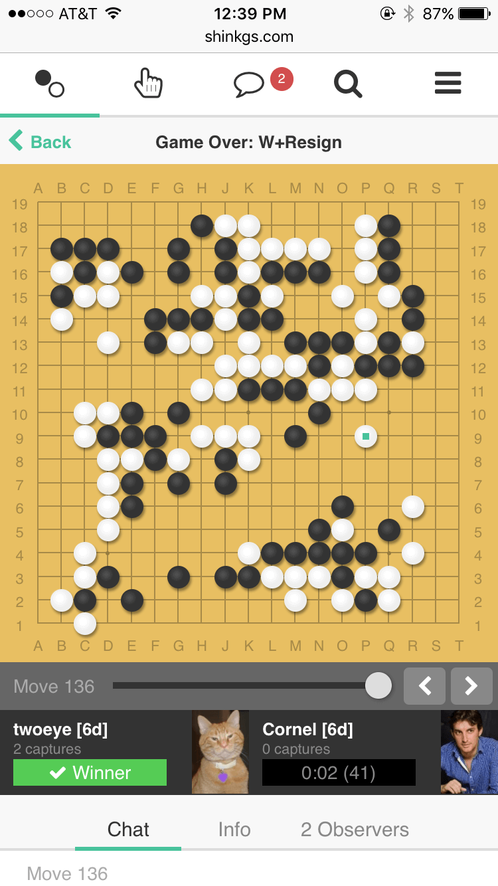

# Shin KGS
[](https://travis-ci.com/jkk/shinkgs)

An unofficial JavaScript client for [KGS Go Server](http://www.gokgs.com/).

- The **official stable version** is available at https://shin.gokgs.com.
- A development version (less stable) is available at https://shinkgs-master.now.sh.

## Screenshot



## Goals

* First-class web and mobile experience
* Retain community vibe of KGS
* Start small, release early
* Work towards native versions (Electron, React Native, Cordova)
* [Bus factor](https://en.wikipedia.org/wiki/Bus_factor) > 1

## Progress

- [x] Game lists
- [x] Game spectating and chat
- [x] Room chat
- [x] User chat (direct messaging)
- [x] View and edit user details
- [x] Submit challenge proposal (no negotiating)
- [x] Create challenge
- [x] Negotiate challenge
- [ ] Automatch
- [x] Basic game playing
- [ ] Full-featured game playing (fine-tuned UI, rengo, simul)
- [ ] Review tools
- [ ] Admin/moderation tools
- [ ] Everything else

For more details, look at [the milestones](https://github.com/jkk/shinkgs/milestones)

## Contributing

Contributions welcome. Please check the [milestones](https://github.com/jkk/shinkgs/milestones) and the [issues](https://github.com/jkk/shinkgs/issues) to help coordinate efforts. Feel free to create an issue if there isn't one already for what you have in mind.

Issues with the ["difficulty-easy"](https://github.com/jkk/shinkgs/issues?q=is%3Aopen+is%3Aissue+label%3Adifficulty-easy) label are good tasks to get started on. Reach out if you need any guidance!

Discord chat group for anyone interested in helping: https://discord.gg/vwzxdVr

## Code Overview

This project uses JavaScript, React, and ES6+ with [Flow](https://flow.org/) types. [VS Code](https://code.visualstudio.com/) (with eslint and flow extensions added) is a great editor for this setup.

State is managed with a Redux-like pattern: there is a single, primary source of truth for app state, plus a bit of component-local state. Messages describing actions are dispatched, which handlers then process to produce the next app state. Unlike typical Redux, no implicit context is used. Everything is passed down through props.

## Development Setup

You'll need [Node.js](https://nodejs.org/en/) and [Yarn](https://yarnpkg.com/en/).

To install and start a local dev server, run:

```
yarn install
yarn start
```

Note: the dev server will use HTTPS, which is required to interact with the KGS API. You will have to trust the self-signed certificate.

Requests are sent to the official KGS API by default. At the moment it's not possible to use a dev KGS API server.

We use Travis as a continuous integration service. The [Travis job](.travis.yml) will run `yarn lint` and `yarn flow` and fails if those failed. So make sure to use it locally.

## Deployment

The official and stable build lives at https://shin.gokgs.com. Each commits is also build and deployed on now.sh on:

```
https://shinkgs-BRANCH.now.sh
```

With `BRANCH` being one of the Git branches of this repository. For example, a live version of master is always available at https://shinkgs-master.now.sh. **Warning**: the `master` branch should always work but is certainly not bullet-proof and bug-free. Use the [official build](https://shin.gokgs.com) for any sensitive games (such as tournaments).

If you are developing the app and want to deploy in the could, use the [now.sh service](https://zeit.co/now):

```
yarn global add now
yarn now-deploy
```

This builds the app then pushes it out to the cloud with a unique URL.

## References

* [KGS API Docs](https://www.gokgs.com/json/protocol.html)
* [KGS API Download](https://www.gokgs.com/help/protocol.html)
* [KGS Client Coding Google Group](https://groups.google.com/forum/#!forum/kgs-client-coding)

## Similar Projects

* [Go Universe](https://github.com/IlyaKirillov/GoUniverse)
* [KGS Leben](https://github.com/stephenmartindale/kgs-leben)
